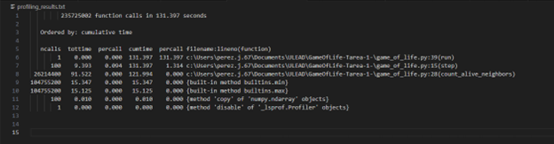

# Capturas de las herramientas de perfilzado utilizadas
## Parte 1 cProfile

*Identificación de Cuellos de Botella*
- count_alive_neighbors es el mayor cuello de botella debido a su alta cantidad de llamadas y el tiempo acumulado que consume. Esto sugiere que optimizar esta función tendría un impacto significativo en el rendimiento general del juego.
- step también es costosa, pero su costo se deriva en gran parte de la llamada a count_alive_neighbors.
